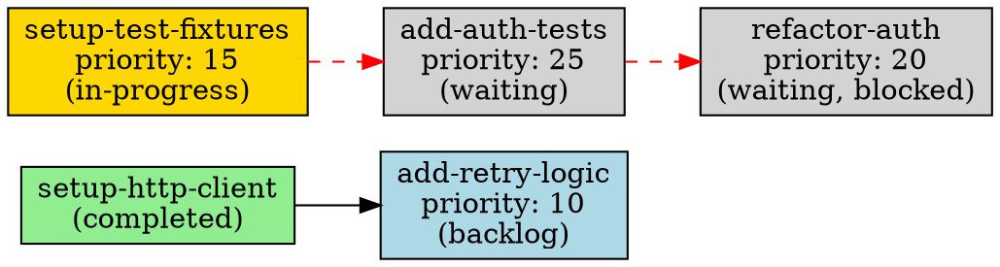

# `mato graph` — Implementation Plan

> **Status: Proposed**

## Summary

Add a `mato graph` command that visualizes task dependency topology and
blockage reasons. The command is read-only, uses no filesystem mutation, and
reuses the existing `internal/dag` analysis and `PollIndex` infrastructure.
Output formats: human-readable text (default), DOT (Graphviz), and JSON.

Estimated effort: ~1.5 days.

## Effort Breakdown

| Task | Effort |
|------|--------|
| `internal/graph/graph.go` — types, `Build()`, `Show()`/`ShowTo()` | 3 hours |
| `internal/graph/graph_test.go` — unit tests | 2.5 hours |
| `internal/graph/render_text.go` — text renderer | 2 hours |
| `internal/graph/render_dot.go` — DOT renderer | 1.5 hours |
| `internal/graph/render_json.go` — JSON renderer | 1 hour |
| `internal/graph/render_test.go` — renderer unit tests | 2 hours |
| `cmd/mato/main.go` — `newGraphCmd()` cobra subcommand | 0.5 hours |
| `cmd/mato/main_test.go` — subcommand wiring tests | 0.5 hours |
| Integration tests in `internal/integration/` | 1 hour |
| Documentation updates | 0.5 hours |
| **Total** | **~1.5 days** |

## Goals

- Visualize dependency topology so users understand why tasks are blocked.
- Expose the rich blocking-reason data that `dag.Analyze()` already produces
  (waiting, unknown, external, ambiguous, cycle) for waiting tasks.
- Reuse `PollIndex` and `DiagnoseDependencies()` — no new filesystem scanning.
- Support machine-readable output (DOT, JSON) for tooling integration.
- Keep the command read-only with zero side effects.
- Ensure no dependency silently vanishes from the graph — all `depends_on`
  references are accounted for as edges, `HiddenDeps`, or `BlockDetails`.

## Non-Goals

- Not a graph editor, conflict simulator, or task planner.
- No affects-overlap visualization in v1 — that is a separate concern from
  dependency topology. Users can see affect conflicts via `mato status` and
  `--dry-run`.
- No interactive mode or pager integration.
- No graph mutation or "what-if" simulation.
- No block-reason classification for non-waiting tasks. Only waiting tasks
  are "blocked" in the mato runtime model. Non-waiting tasks show dependency
  edges (satisfied/unsatisfied) and `HiddenDeps` but do not carry `BlockDetails`.

## CLI Specification

Implement `graph` as a normal Cobra subcommand, following the `status` and
`doctor` pattern. Standard `--repo` and `--tasks-dir` flags for consistency.

```text
mato graph [flags]

Flags:
  --repo <path>           Path to git repository (default: current directory)
  --tasks-dir <path>      Path to tasks directory (default: <repo>/.tasks)
  --format text|dot|json  Output format (default: text)
  --all                   Include completed and failed tasks (default: active only)
```

### Exit Codes

| Code | Meaning |
|------|---------|
| `0`  | Graph rendered successfully (including empty graphs) |
| `1`  | Hard error (repo not a git repository, I/O failure, etc.) |

A missing `.tasks/` directory is **not** a hard error — `BuildIndex`
tolerates missing per-state subdirectories (skipping with `os.IsNotExist`),
so a nonexistent `.tasks/` produces an empty index and a valid empty graph.
Unlike `doctor`, graph does not have graduated exit codes for warnings. It
either succeeds or fails.

### `--format` Validation

Invalid `--format` values are rejected in the cobra `RunE` function, consistent
with `mato status` and `mato doctor`:

```go
if format != "text" && format != "dot" && format != "json" {
    return fmt.Errorf("--format must be text, dot, or json, got %s", format)
}
```

### `--all` Behavior

By default, the graph shows only actionable tasks: `waiting/`, `backlog/`,
`in-progress/`, `ready-for-review/`, and `ready-to-merge/`. Dependencies on
tasks not in the graph are recorded in each dependent node's `HiddenDeps`
list with a status classification:
- `"satisfied"` — dependency is in `safeCompleted` (completed and not ambiguous)
- `"external"` — dependency is known but not completed (e.g., in `failed/`)
- `"ambiguous"` — dependency ID exists in both `completed/` and a non-completed dir
- `"unknown"` — dependency ID not found in any queue directory

With `--all`, completed and failed tasks are included as full nodes with
real `Edge` entries connecting them. `HiddenDeps` is empty when all
referenced tasks have in-graph nodes.

## Design

### New package: `internal/graph/`

A focused package that takes a `PollIndex` and produces structured graph data.
Like `internal/dag/`, it performs no filesystem I/O beyond what the index
already captured.

The package is kept separate from `internal/dag/` because:

- `dag` is a pure graph-theory package (Kahn's + Tarjan). It has no concept of
  queue state, priority, or affects.
- `graph` is a presentation layer that combines DAG analysis results with
  queue metadata (state, priority, branch, failure counts) to produce
  user-facing output.
- `dag` is called by `queue/diagnostics.go` in the hot path of every poll
  cycle; `graph` is called only by the CLI command.

### Data Model

```go
package graph

// NodeState classifies a task's current queue position. Values match
// the queue directory constants from queue.DirWaiting etc.
type NodeState string

const (
    StateWaiting     NodeState = NodeState(queue.DirWaiting)
    StateBacklog     NodeState = NodeState(queue.DirBacklog)
    StateInProgress  NodeState = NodeState(queue.DirInProgress)
    StateReadyReview NodeState = NodeState(queue.DirReadyReview)
    StateReadyMerge  NodeState = NodeState(queue.DirReadyMerge)
    StateCompleted   NodeState = NodeState(queue.DirCompleted)
    StateFailed      NodeState = NodeState(queue.DirFailed)
)

// GraphNode represents a single task in the dependency graph.
type GraphNode struct {
    // Key uniquely identifies this node. Format: "state/filename"
    // (e.g., "waiting/add-auth-tests.md"). Edge endpoints and Cycles
    // entries reference this value.
    Key           string        `json:"key"`
    ID            string        `json:"id"`
    Filename      string        `json:"filename"`
    Title         string        `json:"title,omitempty"`
    State         NodeState     `json:"state"`
    Priority      int           `json:"priority"`
    DependsOn     []string      `json:"depends_on,omitempty"`
    FailureCount  int           `json:"failure_count,omitempty"`
    // BlockDetails is populated only for waiting-state nodes (the only
    // state where tasks can be "blocked" in the mato runtime model).
    BlockDetails  []BlockDetail `json:"block_details,omitempty"`
    IsCycleMember bool          `json:"is_cycle_member,omitempty"`
    // HiddenDeps lists dependencies whose target task has no node in the
    // graph. Each entry carries a status classification so no dependency
    // silently vanishes from the output.
    HiddenDeps    []HiddenDep   `json:"hidden_deps,omitempty"`
}

// BlockDetail describes why a specific dependency blocks a waiting task.
// Only attached to waiting-state nodes. The string Reason is converted
// from dag.BlockReason via blockReasonString().
type BlockDetail struct {
    DependencyID string `json:"dependency_id"`
    Reason       string `json:"reason"` // "waiting", "unknown", "external", "ambiguous"
}

// blockReasonString converts dag.BlockReason to its string representation.
//
//   dag.BlockedByWaiting   → "waiting"
//   dag.BlockedByUnknown   → "unknown"
//   dag.BlockedByExternal  → "external"
//   dag.BlockedByAmbiguous → "ambiguous"
func blockReasonString(r dag.BlockReason) string

// HiddenDep represents a dependency whose target task is not present as a
// node in the graph (e.g., completed or failed tasks when --all=false).
type HiddenDep struct {
    DependencyID string `json:"dependency_id"`
    // Status classifies the hidden dependency using the same sets
    // as DiagnoseDependencies:
    //   "satisfied"  — dep ID in safeCompleted
    //   "external"   — dep ID known but not completed (e.g., in failed/)
    //   "ambiguous"  — dep ID in both completed/ and a non-completed dir
    //   "unknown"    — dep ID not in any queue directory
    Status       string `json:"status"`
}

// Edge represents a dependency relationship between two in-graph nodes.
type Edge struct {
    From      string `json:"from"`       // Key of depended-on node
    To        string `json:"to"`         // Key of dependent node
    Satisfied bool   `json:"satisfied"`
}

// ParseFailure records a task file that could not be parsed.
// Its filename stem is still registered in ID sets by BuildIndex,
// so it may affect dependency resolution. The Path field from
// queue.ParseFailure is intentionally omitted to avoid exposing
// absolute filesystem paths in output.
type ParseFailure struct {
    Filename string `json:"filename"`
    State    string `json:"state"`
    Error    string `json:"error"`
}

// DuplicateWarning records a waiting-directory file that shares its
// meta.ID with another waiting file. The runtime retains only the
// first file (by filename sort order) for DAG analysis; the duplicate
// is still shown as a graph node so it does not silently vanish.
type DuplicateWarning struct {
    Filename    string `json:"filename"`
    DuplicateOf string `json:"duplicate_of"` // filename of the retained file
    SharedID    string `json:"shared_id"`
}

// GraphData is the complete graph structure ready for rendering.
type GraphData struct {
    Nodes             []GraphNode        `json:"nodes"`
    Edges             []Edge             `json:"edges"`
    // Cycles contains SCCs as lists of node keys (not semantic IDs).
    Cycles            [][]string         `json:"cycles,omitempty"`
    ParseFailures     []ParseFailure     `json:"parse_failures,omitempty"`
    DuplicateWarnings []DuplicateWarning `json:"duplicate_warnings,omitempty"`
}
```

### Alias Resolution

`BuildIndex` registers both the filename stem and the frontmatter `meta.ID`
into `allIDs`, `completedIDs`, and `nonCompletedIDs` for every task file
(see `internal/queue/index.go` lines 148–208). A `depends_on` reference
can resolve via either alias.

`Build()` constructs an alias map during node creation for **display-level
edge resolution** — determining which nodes to draw edges between:

```go
// aliasMap maps dependency references (stems and meta.IDs) to the
// node keys they resolve to.
aliasMap := make(map[string][]string) // ref → []nodeKey
```

For each `TaskSnapshot` that becomes a graph node:
1. `frontmatter.TaskFileStem(snap.Filename)` → node key
2. `snap.Meta.ID` → node key (if different from stem)

**Important**: This alias map is broader than the runtime waiting-DAG's
resolution. The runtime DAG only uses `snap.Meta.ID` for waiting-to-waiting
edges (see `internal/dag/dag.go` lines 85–105), while filename stems
provide resolution for completed IDs. The graph intentionally uses the
broader alias resolution to show structural relationships across all
states. See Design Decision "Display edges vs runtime analysis."

### Status Classification

Before resolving edges, `Build()` constructs the same classification sets
as `DiagnoseDependencies`:

```go
safeCompleted := copySet(idx.CompletedIDs())
ambiguousIDs := make(map[string]struct{})
for id := range idx.NonCompletedIDs() {
    if _, dup := safeCompleted[id]; dup {
        delete(safeCompleted, id)
        ambiguousIDs[id] = struct{}{}
    }
}
```

Each dependency reference is classified:
1. Is the reference in `safeCompleted`? → satisfied
2. Is the reference in `ambiguousIDs`? → ambiguous (unsatisfied)
3. Is the reference in `idx.AllIDs()` but not completed? → external (unsatisfied)
4. Is the reference not in `idx.AllIDs()`? → unknown (unsatisfied)

This classification determines `Edge.Satisfied` and `HiddenDep.Status`. It
is independent of alias map cardinality — ambiguity is defined solely by
`ambiguousIDs` membership, matching runtime semantics. When a single
dependency reference fans out to multiple in-graph node keys via the
alias map, an edge is created to each target, all sharing the same
satisfied/unsatisfied status from classification. This fanout is not
the same as runtime ambiguity and is not labeled "ambiguous" unless
the ID is also in `ambiguousIDs`.

### Cycle Key Mapping

Cycle member IDs from `diag.Analysis.Cycles` are semantic IDs (`snap.Meta.ID`)
from retained waiting tasks. They are mapped to node keys through a
**waiting-scoped lookup**, not the global alias map:

```go
// waitingIDToKey maps retained waiting meta.IDs to their node keys.
waitingIDToKey := make(map[string]string)
for id, filename := range diag.RetainedFiles {
    waitingIDToKey[id] = queue.DirWaiting + "/" + filename
}

for _, scc := range diag.Analysis.Cycles {
    var keys []string
    for _, id := range scc {
        if key, ok := waitingIDToKey[id]; ok {
            keys = append(keys, key)
        }
    }
    if len(keys) > 0 {
        sort.Strings(keys)
        data.Cycles = append(data.Cycles, keys)
    }
}
```

This ensures non-waiting nodes with coincidentally matching IDs are never
included in cycles.

### Build Function

```go
// Build constructs the dependency graph from a PollIndex.
// If showAll is true, completed and failed tasks are included as nodes.
// If showAll is false, only actionable tasks are shown; off-graph
// dependencies are recorded in HiddenDeps with status classification.
func Build(tasksDir string, idx *queue.PollIndex, showAll bool) GraphData
```

Steps:

1. Calls `queue.DiagnoseDependencies(tasksDir, idx)` to get the DAG analysis
   for waiting-task blocking reasons and cycle classification.
2. Builds `safeCompleted` and `ambiguousIDs` sets (same derivation as
   `DiagnoseDependencies`).
3. Iterates `idx.TasksByState(dir)` for each directory in `queue.AllDirs`
   to build nodes. For `showAll=false`, skips `queue.DirCompleted` and
   `queue.DirFailed`. Each node's `Key` is `dir + "/" + snap.Filename`.
   Title extracted via `frontmatter.ExtractTitle(snap.Filename, snap.Body)`.
4. Builds `aliasMap` and `nodeByKey` lookup map. All waiting files
   become nodes (including duplicates). Within `waiting/`, when multiple
   files share the same `meta.ID`, the alias map entry points to the
   retained file's node key (matching `diag.RetainedFiles`), and a
   `DuplicateWarning` is emitted for each non-retained file. Duplicate
   files are still full graph nodes — they are not skipped — so nothing
   silently vanishes. Their `BlockDetails` and `IsCycleMember` are not
   populated (only the retained file participates in DAG analysis).
5. For each node with `depends_on`, resolves each reference:
   - Skip empty strings
   - **Classify** the reference using `safeCompleted`, `ambiguousIDs`,
     `idx.AllIDs()`
   - **Route**: look up reference in `aliasMap` for in-graph target(s)
     - If target(s) exist → create `Edge`(s) with `Satisfied` from
       classification
     - If no target → create `HiddenDep` with status from classification
   - Note: a waiting node may have BOTH an `Edge` (from alias resolution)
     AND a `BlockDetail` (from `DiagnoseDependencies`) for the same
     dependency reference. This is correct — the edge shows the structural
     relationship and the BlockDetail explains the runtime blocking reason.
6. For waiting-state nodes only, attaches `BlockDetails` from
   `diag.Analysis.Blocked` (converting via `blockReasonString()`) and
   sets `IsCycleMember` from cycle membership.
7. Maps cycle member IDs to node keys using `waitingIDToKey` (see Cycle Key
   Mapping above). Sets `IsCycleMember: true` on corresponding nodes.
8. Sorts nodes by state order (`queue.AllDirs`), then priority ascending,
   then filename — deterministic output.
9. Sorts edges by (From, To). Sorts `Cycles` by first element. Sorts
   `HiddenDeps` by `DependencyID` within each node.

### Entry Point Functions

The graph package exposes `Show` and `ShowTo`, matching the
`status.Show`/`status.ShowTo` pattern:

```go
// Show writes the dependency graph to os.Stdout.
func Show(repoRoot, tasksDir, format string, showAll bool) error {
    return ShowTo(os.Stdout, repoRoot, tasksDir, format, showAll)
}

// ShowTo resolves the tasks directory, builds the dependency graph, and
// writes it to w in the requested format. repoRoot and tasksDir follow
// the same resolution semantics as status.ShowTo.
func ShowTo(w io.Writer, repoRoot, tasksDir, format string, showAll bool) error {
    if format != "text" && format != "dot" && format != "json" {
        return fmt.Errorf("unsupported format %q", format)
    }
    resolvedRoot, err := git.Output(repoRoot, "rev-parse", "--show-toplevel")
    if err != nil {
        return err
    }
    repoRoot = strings.TrimSpace(resolvedRoot)
    if tasksDir == "" {
        tasksDir = filepath.Join(repoRoot, ".tasks")
    }
    idx := queue.BuildIndex(tasksDir)
    // Fail on directory-level read errors — the index is incomplete
    // and the graph would be silently partial. File-level warnings
    // (e.g., invalid affects globs) are non-fatal and do not prevent
    // rendering, matching how doctor separates the two cases.
    for _, bw := range idx.BuildWarnings() {
        if !isGlobWarning(bw) {
            return fmt.Errorf("incomplete index: %s: %v", bw.State, bw.Err)
        }
    }
    data := Build(tasksDir, idx, showAll)
    switch format {
    case "dot":
        RenderDOT(w, data)
    case "json":
        return RenderJSON(w, data)
    default:
        RenderText(w, data)
    }
    return nil
}
```

This keeps `Build()` as a pure data function (suitable for direct use in
tests and tooling), while `Show()` is the high-level entry point that the
CLI command delegates to.

### Text Renderer

The text renderer produces a human-readable indented view grouped by state.
Tasks with no dependencies and no dependents are listed as standalone items.
Tasks with dependencies show their dependency tree.

Example output with a mix of states:

```text
mato graph — 5 tasks, 3 edges, 1 cycle

waiting/
  refactor-auth (priority: 20, blocked)
    ├── add-auth-tests (waiting, blocked)
    │   └── setup-test-fixtures (in-progress ⟳)
    └── migrate-db-schema (completed ✓)

  add-auth-tests (priority: 25, blocked)
    └── setup-test-fixtures (in-progress ⟳)

  config-overhaul (priority: 30, cycle ⚠)
    └── config-overhaul (self-dependency)

backlog/
  add-retry-logic (priority: 10)
    └── setup-http-client (completed ✓)

in-progress/
  setup-test-fixtures (priority: 15)
```

Design principles for the text output:

- **Grouped by state**: waiting first (most interesting), then backlog,
  in-progress, ready-for-review, ready-to-merge. Follows `queue.AllDirs` order.
- **Dependency trees are inline**: each task shows its `depends_on` entries
  indented below it, with status annotations.
- **Status indicators**: `✓` satisfied, `⟳` in-progress, `⚠` cycle/blocked,
  `✗` external/unknown. No emoji beyond these established Unicode symbols.
- **HiddenDeps rendered inline**: `(completed ✓)` for satisfied,
  `(external ✗)` for external, `(ambiguous ⚠)` for ambiguous,
  `(unknown ?)` for unknown.
- **Standalone tasks** (no deps, no dependents) are listed with just their
  priority.
- **No agent attribution** in v1. `TaskSnapshot` does not carry a
  `ClaimedBy` field. HTML comments (`<!-- claimed-by: ... -->`) are skipped
  before frontmatter detection and stripped from the returned body by
  `frontmatter.stripHTMLCommentLines`; `taskfile.ParseClaimedBy()` extracts
  them independently via regex. Showing the agent ID would require calling
  `queue.ParseClaimedBy()` per in-progress file, adding filesystem I/O
  that the graph package otherwise avoids. A future version could extend
  `TaskSnapshot` with a `ClaimedBy` field.
- **Cycle members** are called out explicitly.
- **Deduplication**: every task appears as a primary node under its state
  heading with full detail. When the same task appears as a dependency
  reference under another task, it uses a short form (ID + state
  annotation) to avoid redundant output in diamond-shaped graphs.

### DOT Renderer

Produces valid Graphviz DOT for piping to `dot -Tpng` or `dot -Tsvg`.
DOT node identifiers use the node `Key` (state/filename), which is always
unique and avoids collisions when duplicate semantic IDs exist across states.
The following example uses `--all` to include completed task nodes as
full graph entries with real edges; without `--all`, completed
dependencies appear only in `HiddenDeps` and are not rendered as
nodes or edges.



**Cycle edge rule**: An edge is rendered as a cycle edge (bold, red) when
both `From` and `To` node keys appear in the **same** entry (SCC) of
`GraphData.Cycles`. Checking the same SCC prevents mis-styling edges
between nodes that belong to different independent cycles.

**DOT escaping**: task IDs containing special characters (quotes,
backslashes) are escaped in DOT node identifiers and labels.

Color scheme:

| State | Fill color | Hex |
|-------|-----------|-----|
| completed | light green | `#90EE90` |
| backlog | light blue | `#ADD8E6` |
| in-progress | gold | `#FFD700` |
| ready-for-review | light orange | `#FFDAB9` |
| ready-to-merge | pale green | `#98FB98` |
| waiting | light gray | `#D3D3D3` |
| failed | salmon | `#FA8072` |

Edge styles:

| Edge type | Style |
|-----------|-------|
| Satisfied (dep completed) | solid, black |
| Blocked (dep not completed) | dashed, red |
| Cycle edge | bold, red |

### JSON Renderer

Serializes `GraphData` directly via `encoding/json` with indentation.
The schema is the `GraphData` struct itself — no wrapper. JSON consumers
get the full node and edge data for programmatic analysis.

```json
{
  "nodes": [
    {
      "key": "backlog/add-retry-logic.md",
      "id": "add-retry-logic",
      "filename": "add-retry-logic.md",
      "title": "Add retry logic to HTTP client",
      "state": "backlog",
      "priority": 10,
      "depends_on": ["setup-http-client"],
      "hidden_deps": [
        {"dependency_id": "setup-http-client", "status": "satisfied"}
      ]
    }
  ],
  "edges": [],
  "parse_failures": []
}
```

## Design Decisions

### 1. Graph scope extends beyond waiting tasks

`DiagnoseDependencies()` in `queue/diagnostics.go` builds DAG nodes only from
`waiting/` tasks — that is all the runtime reconciler needs. But `mato graph`
must show dependency edges for tasks in **all** states: a backlog task with
`depends_on: [setup-http-client]` still has that relationship even though
`setup-http-client` is completed and the task was promoted.

`Build()` therefore does its own full-state traversal of the `PollIndex`
rather than delegating entirely to `DiagnoseDependencies()`. It calls
`DiagnoseDependencies(tasksDir, idx)` to get the `Analysis` result for
waiting-task blocking reasons and cycle detection, but independently walks
`idx.TasksByState(dir)` for every directory to build the full node and edge
set.

For non-waiting tasks, dependency satisfaction is determined by deriving a
`safeCompleted` set from `idx.CompletedIDs()` minus `idx.NonCompletedIDs()`
— the same ambiguous-ID exclusion that `DiagnoseDependencies` performs
before calling `dag.Analyze()`. Ambiguous IDs (present in both `completed/`
and a non-completed directory) are never treated as satisfied, matching
runtime behavior. No new analysis logic is needed; the graph simply
annotates edges as satisfied or unsatisfied based on whether the dependency
ID appears in `safeCompleted`.

### 2. Block details are waiting-task-only

Only waiting tasks can be "blocked" in the mato runtime model. Tasks in
backlog, in-progress, ready-for-review, and ready-to-merge have already
been promoted and are not subject to dependency-based blocking.
`BlockDetails` are therefore only populated for waiting-state nodes.
Non-waiting tasks show dependency edges with `Satisfied: true/false` and
`HiddenDeps` but carry no `BlockDetails`. This avoids inventing new
blocking semantics that don't exist in the runtime.

### 3. Display edges vs runtime analysis

The graph serves two purposes: (1) show structural dependency relationships
between tasks, and (2) explain why waiting tasks are blocked. These use
different resolution semantics:

**Edges** use the full alias resolution available from `BuildIndex` — both
filename stems and frontmatter `meta.ID` values across all states. This
gives a complete "what depends on what" picture. A waiting task referencing
another waiting task's filename stem will produce a display edge even though
the runtime waiting-DAG (which uses only `meta.ID` for waiting-to-waiting
matching) does not analyze that as a waiting dependency.

**BlockDetails** come strictly from `DiagnoseDependencies` and reflect
actual runtime blocking classification. They are attached only to waiting
nodes and use the runtime's semantic-ID-based analysis.

A node can carry both an `Edge` to another node and a `BlockDetail` for
the same dependency when the display alias resolution finds the target but
the runtime classifies it differently (e.g., a stem reference to a waiting
task classified as `BlockedByExternal`). This is intentional: the edge
shows the user where the dependency actually points, and the BlockDetail
explains how the runtime treats it.

### 4. Status classification matches the runtime exactly

Dependency satisfaction uses the same `safeCompleted`, `ambiguousIDs`, and
`idx.AllIDs()` derivation as `DiagnoseDependencies`. Alias map cardinality
(one reference mapping to multiple node keys) does NOT determine ambiguity
status. Ambiguity is defined solely by `ambiguousIDs` membership.

### 5. Node keys are unique across the graph

The `Key` field (`"state/filename"`) uniquely identifies each node. This
handles the case where the same semantic `meta.ID` appears in multiple
states (which the runtime treats as ambiguous). `Edge.From` and `Edge.To`
reference node keys, ensuring every edge endpoint has exactly one
corresponding node in the JSON/DOT output.

### 6. Cycle key mapping is waiting-scoped

Cycle members from `diag.Analysis.Cycles` are mapped to node keys through
a waiting-only lookup (`diag.RetainedFiles`), not the global alias map.
This prevents non-waiting nodes with matching IDs from being incorrectly
marked as cycle members.

### 7. No dependency silently vanishes

Every `depends_on` reference is accounted for as either:
- An `Edge` to an in-graph node
- A `HiddenDep` with status classification
- A `BlockDetail` (waiting nodes only, from `DiagnoseDependencies`)

The `HiddenDeps` field ensures that off-graph unsatisfied dependencies
(e.g., failed tasks when `showAll=false`) are visible to users and
machine consumers.

Duplicate waiting files (sharing a `meta.ID`) are kept as full graph
nodes and surfaced via `DuplicateWarnings`, rather than being silently
skipped. Directory-level build warnings (read failures) cause `ShowTo`
to return an error rather than rendering a silently partial graph.
File-level warnings (e.g., invalid affects globs) are non-fatal and
do not prevent rendering.

### 8. Ambiguous IDs produce warning annotations, not errors

Runtime ambiguity (an ID in both `completedIDs` and `nonCompletedIDs`) is
classified as `"ambiguous"`, matching `BlockedByAmbiguous` from
`dag.Analyze()`. This is a distinct concept from alias-map fanout, where
one dependency reference resolves to multiple in-graph node keys (e.g.,
the same filename stem in two non-completed directories). Fanout produces
multiple edges — one per target — each with its own satisfied/unsatisfied
status from classification. Fanout edges are not labeled "ambiguous"
unless the underlying ID is also in `ambiguousIDs`. The graph does not
overload the runtime's ambiguity semantics.

### 9. Tasks with no dependencies and no dependents are included

Standalone tasks (no `depends_on`, not referenced by any other task's
`depends_on`) are shown as leaf nodes. This gives a complete picture of
the queue and avoids the surprise of tasks "disappearing" from the graph.

### 10. DOT output uses `rankdir=LR` (left-to-right)

Dependency graphs are most readable when the flow goes from left
(prerequisites) to right (dependents), matching the natural reading
direction. Top-to-bottom (`rankdir=TB`) compresses wide graphs but
makes long chains hard to follow. Users who prefer top-to-bottom can
post-process the DOT output.

### 11. No dependency on external graphviz tools at runtime

`mato graph --format dot` outputs raw DOT text to stdout. The user pipes
it to `dot`, `neato`, or any other Graphviz tool. mato does not invoke
Graphviz itself, keeping the dependency footprint at zero external tools.
This is consistent with mato's existing approach: structured data on
stdout, rendering left to the consumer.

### 12. Text renderer handles duplicate appearances

A task may appear both as a primary node (listed under its state) and as a
dependency reference (indented under another task). The text renderer
deduplicates by showing the full detail at the primary listing and using
a short reference (ID + state annotation) when it appears as a dependency.
This prevents redundant output in diamond-shaped graphs.

## Integration with Existing Code

### PollIndex reuse

`Build()` accepts a `*queue.PollIndex`. When called from `ShowTo()`, the
index is built once via `queue.BuildIndex(tasksDir)`. This matches the pattern
used by `gatherStatus()` in `internal/status/status_gather.go`.

### DiagnoseDependencies reuse

The graph calls `queue.DiagnoseDependencies(tasksDir, idx)` to get the
`DependencyDiagnostics` result (which embeds `dag.Analysis`) for
waiting-task classification (blocked reasons and cycle detection). This is
the same function used by `queue.ReconcileReadyQueue()`. For non-waiting
tasks, the graph derives `safeCompleted` from `idx.CompletedIDs()` minus
`idx.NonCompletedIDs()` to determine edge satisfaction — the same
ambiguous-ID exclusion that `DiagnoseDependencies` applies internally.
See Design Decision #1 above.

### TaskSnapshot data

Node metadata (title, priority, branch, failure count) comes from
`idx.TasksByState(dir)` which returns `[]*queue.TaskSnapshot`. The
`TaskSnapshot` struct contains `Meta` (frontmatter), `Body`, `Branch`,
`FailureCount`, and `State` — everything the graph needs except
`claimed-by` agent attribution, which is omitted in v1 (see Text Renderer
design principles).

### Title extraction

Task titles are extracted from the body via `frontmatter.ExtractTitle()`,
matching the approach used by `merge.ProcessQueue()` and `status`. Falls
back to the filename stem.

### No changes to existing packages required

The graph package consumes only existing public APIs from `queue`, `dag`,
`git`, and `frontmatter`:

- `queue.BuildIndex(tasksDir)` — build the index
- `queue.DiagnoseDependencies(tasksDir, idx)` — waiting-task analysis
- `queue.AllDirs` — canonical directory list for iteration
- `queue.DirWaiting`, `queue.DirCompleted`, `queue.DirFailed` — state constants
- `idx.TasksByState(dir)` — iterate tasks per state
- `idx.CompletedIDs()` — base completed set (before ambiguous-ID exclusion)
- `idx.NonCompletedIDs()` — IDs in non-completed dirs (for safeCompleted derivation)
- `idx.AllIDs()` — all known IDs for reference resolution
- `idx.ParseFailures()` — files that failed parsing (for warning output)
- `idx.BuildWarnings()` — directory-level read failures (hard error) and
  file-level glob warnings (non-fatal, ignored by graph)
- `git.Output(repoRoot, ...)` — resolve git root (in `ShowTo()`)
- `frontmatter.ExtractTitle(filename, body)` — derive task titles
- `frontmatter.TaskFileStem(filename)` — filename stem for alias resolution

No new methods or exported functions need to be added to existing packages.

## Implementation Plan

### Phase 1: Core graph builder (internal/graph/)

1. Create `internal/graph/graph.go` with the `GraphData`, `GraphNode`, `Edge`,
   `BlockDetail`, `HiddenDep`, `ParseFailure`, `DuplicateWarning` types
   and `blockReasonString()`.
2. Implement `Build(tasksDir string, idx *queue.PollIndex, showAll bool) GraphData`
   with alias map construction, status classification, edge/HiddenDep routing,
   and cycle key mapping.
3. Implement `Show(repoRoot, tasksDir, format string, showAll bool) error` and
   `ShowTo(w io.Writer, repoRoot, tasksDir, format string, showAll bool) error`.
4. Unit tests in `internal/graph/graph_test.go` using `t.TempDir()` and
   `queue.BuildIndex()` (PollIndex has unexported fields), covering:
   - Empty queue (no tasks in any directory)
   - Single task with no dependencies
   - Linear chain: A → B → C with mixed states
   - Diamond dependency: D depends on B and C, both depend on A
   - Cycle detection: mutual dependency and self-dependency
   - `showAll=false` omits completed/failed nodes; completed deps in HiddenDep(satisfied)
   - `showAll=false` with failed deps → HiddenDep(external)
   - `showAll=true` includes completed/failed as nodes with real edges
   - Alias resolution: depends_on uses filename stem vs meta.ID
   - Stem alias to waiting task: edge exists, BlockDetail is external
     (runtime DAG only matches by meta.ID, so stem is classified as external)
   - Ambiguous IDs (completed + non-completed): HiddenDep(ambiguous) or unsatisfied edge
   - Duplicate IDs only in completed (NOT ambiguous per runtime rules)
   - Duplicate IDs only across non-completed states (NOT ambiguous unless also in completedIDs)
   - Duplicate waiting IDs: both files are nodes, non-retained file gets
     DuplicateWarning, alias map points to retained file only
   - Parse failures: stem in ID sets, no node, listed in ParseFailures
   - Build warnings: directory read failure → ShowTo returns error
   - Invalid affects glob warning does NOT make ShowTo fail
   - Cycle member with duplicate ID in non-waiting state under `--all`:
     only waiting node in Cycles, non-waiting NOT marked IsCycleMember
   - Deterministic ordering (sorted by state, priority, filename)
   - Node key uniqueness

### Phase 2: Renderers

5. Implement `RenderText(w io.Writer, data GraphData)` in `render_text.go`.
6. Implement `RenderDOT(w io.Writer, data GraphData)` in `render_dot.go`.
7. Implement `RenderJSON(w io.Writer, data GraphData) error` in
   `render_json.go`.
8. Unit tests in `internal/graph/render_test.go` (using directly-constructed
   `GraphData` structs — public fields) covering:
   - Empty graph
   - Graph with cycles (text: cycle warning annotation; DOT: bold red edges
     identified by same-SCC membership)
   - Graph with blocked tasks (text: block reason; DOT: dashed red edges)
   - HiddenDeps annotations (text: inline status; JSON: structured)
   - Deterministic output (byte-for-byte comparison)
   - DOT escaping for special characters in task IDs
   - JSON round-trip: marshal → unmarshal → compare

### Phase 3: CLI wiring

9. Add `newGraphCmd()` to `cmd/mato/main.go` following the `newStatusCmd()`
   pattern: format validation, `resolveRepo()`, then delegation to
   `graph.Show()`.
10. Wire it in `newRootCmd()` with `root.AddCommand(newGraphCmd())`.
11. Add CLI-level tests in `cmd/mato/main_test.go` for flag validation
    (`--format invalid`), `--help` output, and basic end-to-end.

### Phase 4: Integration & docs

12. Add integration tests in `internal/integration/graph_test.go` that set
    up a repo with `testutil.SetupRepoWithTasks()`, place tasks in various
    directories with dependency chains (including alias references and
    ambiguous IDs), and validate `ShowTo` output for each format.
13. Update `README.md` with `mato graph` in the commands section.
14. Update `AGENTS.md` project layout with `internal/graph/`.
15. Update `docs/architecture.md` to reference the graph command.

## Cobra Subcommand

The cobra command is thin — format validation then delegation to
`graph.Show()`, matching the `newStatusCmd()` pattern.

```go
func newGraphCmd() *cobra.Command {
    var graphRepo string
    var graphTasksDir string
    var format string
    var showAll bool

    cmd := &cobra.Command{
        Use:           "graph",
        Short:         "Visualize task dependency topology",
        SilenceUsage:  true,
        SilenceErrors: true,
        Args:          cobra.NoArgs,
        RunE: func(cmd *cobra.Command, args []string) error {
            if format != "text" && format != "dot" && format != "json" {
                return fmt.Errorf("--format must be text, dot, or json, got %s", format)
            }
            repo, err := resolveRepo(graphRepo)
            if err != nil {
                return err
            }
            return graph.Show(repo, graphTasksDir, format, showAll)
        },
    }

    cmd.Flags().StringVar(&graphRepo, "repo", "", "Path to git repository (default: current directory)")
    cmd.Flags().StringVar(&graphTasksDir, "tasks-dir", "", "Path to the tasks directory (default: <repo>/.tasks)")
    cmd.Flags().StringVar(&format, "format", "text", "Output format: text, dot, or json")
    cmd.Flags().BoolVar(&showAll, "all", false, "Include completed and failed tasks")

    return cmd
}
```

## Backward Compatibility

No existing behavior changes. `mato graph` is a pure addition with no
interaction with the poll loop, agent lifecycle, or merge queue. It reads
only; it writes nothing.

The command works on any `.tasks/` directory, including one from a repo
that has never run `mato`. A missing `.tasks/` directory is tolerated by
`BuildIndex` (which skips missing per-state subdirectories), producing
an empty index and a valid empty graph at exit 0.

## Testing Strategy

### Unit tests

- `internal/graph/graph_test.go`: test `Build()` with real filesystem
  directories created via `t.TempDir()` and indexed via `queue.BuildIndex()`.
  `PollIndex` has unexported fields and cannot be constructed directly.
  Each test case creates the needed task files, calls `BuildIndex`, then
  calls `Build()` and asserts on the resulting `GraphData`.
- `internal/graph/render_test.go`: test each renderer against known
  `GraphData` inputs (constructed directly — `GraphData` is a public struct
  with public fields) with byte-exact expected output.

### Integration tests

- `internal/integration/graph_test.go`: set up a real repo with
  `testutil.SetupRepoWithTasks()`, validate `ShowTo` output for each
  format. Covers the full path: git-root resolution → index build →
  Build → render.

### Test patterns

- Standard `testing` package, table-driven with `t.Run`.
- Test naming: `TestBuild_EmptyQueue`, `TestBuild_LinearChain`,
  `TestBuild_AliasResolution`, `TestBuild_StemAliasToWaiting`,
  `TestBuild_AmbiguousIDs`, `TestBuild_HiddenExternalDep`,
  `TestBuild_CycleKeyMapping`, `TestRenderDOT_Escaping`, etc.
- Use `t.TempDir()` for filesystem tests, `t.Helper()` in helpers.
- No mocks — `Build()` tests use real filesystem + `BuildIndex()`.
  Renderer tests use directly-constructed `GraphData` structs.

## Edge Cases

### Empty queue

When no tasks exist in any directory (or `.tasks/` doesn't exist yet),
`Build()` returns a `GraphData` with empty `Nodes` and `Edges`. The text
renderer prints `mato graph — 0 tasks` and exits 0. DOT and JSON render
valid but empty structures.

### Parse failures

Tasks that fail frontmatter parsing are recorded as `ParseFailure` entries
in the `PollIndex` and are excluded from the graph as nodes (they have no
usable metadata). However, `BuildIndex` registers filename stems into
`allIDs`, `completedIDs`, and `nonCompletedIDs` **before** attempting to
parse frontmatter, so a malformed file's stem can still satisfy or block
dependencies via those ID sets. This matches the runtime behavior — the
graph does not attempt to correct or diverge from how the reconciler
treats unparseable files.

The text renderer prints a warning footer listing unparseable files
(matching how `--dry-run` reports parse errors). DOT and JSON include
parse failures as a top-level `parse_failures` array so consumers are
aware of files that contributed to ID sets but could not be fully indexed.

### Disconnected subgraphs

A queue with multiple independent dependency chains produces a single
graph with disconnected components. The text renderer groups by state
regardless of connectivity. The DOT renderer relies on Graphviz layout
to arrange disconnected components. No special handling needed.

### Tasks with `depends_on` references to themselves

Self-dependencies are caught by `dag.Analyze()` as single-node SCCs with
self-edges. The graph marks these nodes with `IsCycleMember: true` and
creates a self-referencing edge. The text renderer shows
`(self-dependency)`. The DOT renderer draws a self-loop edge in bold red.

### `depends_on` entries with empty strings

Empty strings in `depends_on` arrays are skipped during edge creation,
matching `dag.Analyze()` which also skips empty dependency strings. Also
filtered by `frontmatter.ParseTaskData` which calls `filterEmpty`.

### Ambiguous dependency IDs

When a `depends_on` reference resolves to tasks in both `completed/` and a
non-completed directory (e.g., a duplicate ID), the dependency is classified
as `BlockedByAmbiguous` by `dag.Analyze()`. The graph marks the edge with
`Reason: "ambiguous"` and the text renderer annotates it with `(ambiguous ⚠)`.
This matches the runtime behavior where the task stays blocked rather than
being silently promoted.

This is distinct from alias-map fanout, where one reference resolves to
multiple in-graph node keys that are not in `ambiguousIDs`. Fanout produces
multiple edges, each with its own satisfied/unsatisfied status, but they are
not labeled "ambiguous".

### Duplicate waiting IDs

When two files in `waiting/` share the same `meta.ID`, both files become
graph nodes (unique keys via `state/filename`). The runtime retains only
the first file (by filename sort order) for DAG analysis; the duplicate is
recorded in `GraphData.DuplicateWarnings`. The alias map points only to
the retained file's node key, so edges target the retained file. The
duplicate node appears under its state heading but carries no `BlockDetails`
or `IsCycleMember` (it is not in `diag.RetainedFiles`). Text output
prints a warning about the duplicate.

### Stem alias to waiting task

A waiting task referencing another waiting task's filename stem (not its
`meta.ID`) produces a display edge between the two nodes. However, the
runtime DAG only matches waiting-to-waiting dependencies by `meta.ID`, so
`DiagnoseDependencies` classifies the stem reference as `BlockedByExternal`.
Both the edge and the `BlockDetail` coexist on the node — the edge shows
the structural relationship, the BlockDetail explains the runtime behavior.

### Hidden external dependencies

When `showAll=false` and a task depends on a failed-state task, no edge is
created (the failed task has no in-graph node). Instead, a `HiddenDep` with
`Status: "external"` is added. This ensures the dependency is visible in
all output formats.

### Very large queues

For queues with hundreds of tasks, the text renderer may produce output
longer than a terminal screen. v1 does not paginate or truncate — users
can pipe to `less` or use `--format json` for programmatic access. The
`--depth` flag discussed in Open Questions would address this in v2.

## Open Questions

1. **Should `mato graph` show affects-deferred tasks?** v1 excludes them
   (dependency topology only). A future `--conflicts` flag could add
   this, but it mixes two orthogonal concepts.

2. **Should DOT output include a legend?** Adding a `subgraph cluster_legend`
   with color keys is cheap but adds visual noise to small graphs. Could
   be gated behind a `--legend` flag.

3. **Should text output truncate deeply nested chains?** For very deep
   dependency trees (>10 levels), the indentation could go off-screen.
   v1 prints the full tree; a future `--depth N` flag could cap it.

4. **Should the command accept task IDs as positional args to scope the
   graph?** e.g., `mato graph add-retry-logic` shows only the subgraph
   reachable from that task. Useful for large queues, but adds complexity.
   Defer to v2.

5. **Should `ReviewFailureCount` be exposed in graph output?** The
   `TaskSnapshot` tracks it separately from `FailureCount`. v1 includes
   `FailureCount` only; `ReviewFailureCount` can be added if users need it.

## Maintaining This Proposal

This proposal describes the `mato graph` design. Once implemented, mark
the status as "Implemented" and update the text to note the proposal
origin. Detailed behavior documentation belongs in the command's `--help`
output and `docs/architecture.md`.
