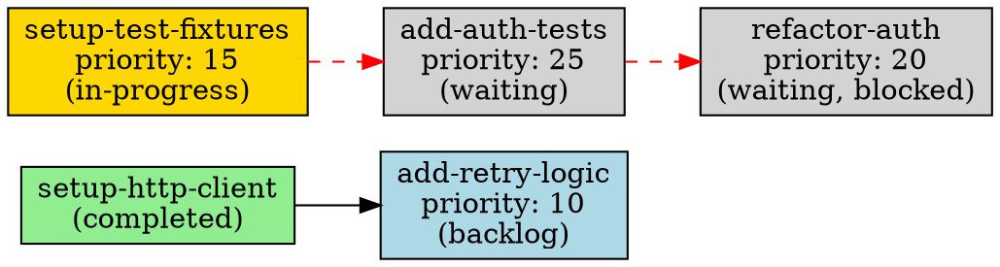

# `mato graph` — Implementation Plan

> **Status: Proposed**

## Summary

Add a `mato graph` command that visualizes task dependency topology and
blockage reasons. The command is read-only, uses no filesystem mutation, and
reuses the existing `internal/dag` analysis and `PollIndex` infrastructure.
Output formats: human-readable text (default), DOT (Graphviz), and JSON.

Estimated effort: ~1.5 days.

## Effort Breakdown

| Task | Effort |
|------|--------|
| `internal/graph/graph.go` — `Build()` + `Show()` entry point producing `GraphData` | 2.5 hours |
| `internal/graph/graph_test.go` — unit tests (empty, linear, diamond, cycle, mixed states) | 2 hours |
| `internal/graph/render_text.go` — indented tree text renderer | 2 hours |
| `internal/graph/render_dot.go` — DOT format renderer | 1.5 hours |
| `internal/graph/render_json.go` — JSON format renderer | 1 hour |
| `internal/graph/render_test.go` — renderer unit tests | 2 hours |
| `cmd/mato/main.go` — `newGraphCmd()` cobra subcommand | 0.5 hours |
| `cmd/mato/main_test.go` — subcommand wiring tests | 0.5 hours |
| Integration tests in `internal/integration/` | 1 hour |
| Documentation updates (README, docs/architecture.md) | 0.5 hours |
| **Total** | **~1.5 days** |

## Goals

- Visualize dependency topology so users understand why tasks are blocked.
- Expose the rich blocking-reason data that `dag.Analyze()` already produces
  (waiting, unknown, external, ambiguous, cycle).
- Reuse `PollIndex` and `DiagnoseDependencies()` — no new filesystem scanning.
- Support machine-readable output (DOT, JSON) for tooling integration.
- Keep the command read-only with zero side effects.

## Non-Goals

- Not a graph editor, conflict simulator, or task planner.
- No affects-overlap visualization in v1 — that is a separate concern from
  dependency topology. Users can see affect conflicts via `mato status` and
  `--dry-run`.
- No interactive mode or pager integration.
- No graph mutation or "what-if" simulation.

## CLI Specification

Implement `graph` as a normal Cobra subcommand, following the `status` and
`doctor` pattern. Standard `--repo` and `--tasks-dir` flags for consistency.

```text
mato graph [flags]

Flags:
  --repo <path>        Path to git repository (default: current directory)
  --tasks-dir <path>   Path to tasks directory (default: <repo>/.tasks)
  --format text|dot|json  Output format (default: text)
  --all                Include completed and failed tasks (default: active only)
```

### Exit Codes

| Code | Meaning |
|------|---------|
| `0`  | Graph rendered successfully (including empty graphs) |
| `1`  | Hard error (repo not a git repository, I/O failure, etc.) |

A missing `.tasks/` directory is **not** a hard error — `BuildIndex`
tolerates missing per-state subdirectories (skipping with `os.IsNotExist`),
so a nonexistent `.tasks/` produces an empty index and a valid empty graph.
Unlike `doctor`, graph does not have graduated exit codes for warnings. It
either succeeds or fails.

### `--format` Validation

Invalid `--format` values are rejected in the cobra `RunE` function, consistent
with `mato status` and `mato doctor`:

```go
if format != "text" && format != "dot" && format != "json" {
    return fmt.Errorf("--format must be text, dot, or json, got %s", format)
}
```

### `--all` Behavior

By default, the graph shows only actionable tasks: `waiting/`, `backlog/`,
`in-progress/`, `ready-for-review/`, and `ready-to-merge/`. Dependencies on
completed tasks are recorded in each dependent node's `SatisfiedDeps` list
and rendered as inline annotations (e.g., `(completed ✓)`) — no `Edge` or
node is created for them.

With `--all`, completed and failed tasks are included as full nodes with
real `Edge` entries connecting them. This is useful for understanding the
full dependency history of a task chain.

## Design

### New package: `internal/graph/`

A focused package that takes a `PollIndex` and produces structured graph data.
Like `internal/dag/`, it performs no filesystem I/O beyond what the index
already captured.

The package is kept separate from `internal/dag/` because:

- `dag` is a pure graph-theory package (Kahn's + Tarjan). It has no concept of
  queue state, priority, or affects.
- `graph` is a presentation layer that combines DAG analysis results with
  queue metadata (state, priority, branch, failure counts) to produce
  user-facing output.
- `dag` is called by `queue/diagnostics.go` in the hot path of every poll
  cycle; `graph` is called only by the CLI command.

### Data Model

```go
package graph

// NodeState classifies a task's current queue position.
type NodeState string

const (
    StateWaiting       NodeState = "waiting"
    StateBacklog       NodeState = "backlog"
    StateInProgress    NodeState = "in-progress"
    StateReadyReview   NodeState = "ready-for-review"
    StateReadyMerge    NodeState = "ready-to-merge"
    StateCompleted     NodeState = "completed"
    StateFailed        NodeState = "failed"
)

// GraphNode represents a single task in the dependency graph.
type GraphNode struct {
    ID            string        `json:"id"`
    Filename      string        `json:"filename"`
    Title         string        `json:"title,omitempty"`
    State         NodeState     `json:"state"`
    Priority      int           `json:"priority"`
    DependsOn     []string      `json:"depends_on,omitempty"`
    FailureCount  int           `json:"failure_count,omitempty"`
    BlockDetails  []BlockDetail `json:"block_details,omitempty"`
    IsCycleMember bool          `json:"is_cycle_member,omitempty"`
    // SatisfiedDeps lists dependency IDs that are satisfied but whose
    // source task has no corresponding node in the graph (e.g., a
    // completed dep when --all=false). Renderers use this for inline
    // annotations rather than producing edges to nonexistent nodes.
    SatisfiedDeps []string      `json:"satisfied_deps,omitempty"`
}

// BlockDetail describes why a specific dependency blocks this task.
// Named to parallel dag.BlockDetail, with string Reason for JSON output.
type BlockDetail struct {
    DependencyID string `json:"dependency_id"`
    Reason       string `json:"reason"` // "waiting", "unknown", "external", "ambiguous"
}

// Edge represents a dependency relationship.
type Edge struct {
    From      string `json:"from"`       // depended-on task ID
    To        string `json:"to"`         // dependent task ID
    Satisfied bool   `json:"satisfied"`
}

// ParseFailure records a task file that could not be parsed.
// Its filename stem is still registered in ID sets by BuildIndex,
// so it may affect dependency resolution.
type ParseFailure struct {
    Filename string `json:"filename"`
    State    string `json:"state"`
    Error    string `json:"error"`
}

// GraphData is the complete graph structure ready for rendering.
type GraphData struct {
    Nodes         []GraphNode    `json:"nodes"`
    Edges         []Edge         `json:"edges"`
    Cycles        [][]string     `json:"cycles,omitempty"`
    ParseFailures []ParseFailure `json:"parse_failures,omitempty"`
}
```

### Build Function

```go
// Build constructs the dependency graph from a PollIndex.
// If showAll is true, completed and failed tasks are included as nodes.
// If showAll is false, only actionable tasks are shown; completed
// dependencies are recorded in SatisfiedDeps on the dependent node.
func Build(tasksDir string, idx *queue.PollIndex, showAll bool) GraphData
```

The implementation:

1. Calls `queue.DiagnoseDependencies(tasksDir, idx)` to get the DAG analysis
   for waiting-task blocking reasons and cycle classification.
2. Iterates `idx.TasksByState(dir)` for each directory in `queue.AllDirs`
   to build nodes. For `showAll=false`, skips `DirCompleted` and `DirFailed`.
   For `showAll=true`, includes all directories.
3. Builds a lookup map from task ID → `*GraphNode` for edge resolution.
   Within `waiting/`, duplicate IDs are deduplicated (first filename wins,
   matching `DiagnoseDependencies` which skips duplicates). Across
   directories, duplicate IDs are **not** resolved winner-take-all — if an
   ID exists in both `completed/` and a non-completed directory, it is
   ambiguous and treated as unsatisfied (see step 4).
4. Derives `safeCompleted` from `idx.CompletedIDs()` by removing any ID
   that also appears in `idx.NonCompletedIDs()` (the same ambiguous-ID
   exclusion that `DiagnoseDependencies` performs). For each node with
   `depends_on`, resolves each dependency ID:
   - If the ID maps to an in-graph node, creates an `Edge` with
     `Satisfied` set based on `safeCompleted`.
   - If the ID is in `safeCompleted` but has no in-graph node (e.g.,
     completed dep with `showAll=false`), appends it to the dependent
     node's `SatisfiedDeps` — no `Edge` is created.
   - If the ID is ambiguous, creates an unsatisfied `Edge` (for in-graph
     targets) or a `BlockDetail` with `Reason: "ambiguous"` (for
     off-graph targets).
5. For waiting-task nodes, attaches `BlockDetails` from
   `diag.Analysis.Blocked` and `IsCycleMember` from
   `diag.Analysis.Cycles`.
6. Sorts nodes by state order (waiting → backlog → in-progress →
   ready-for-review → ready-to-merge → completed → failed), then by priority
   ascending, then by filename — deterministic output.
7. Sorts edges by (From, To) for deterministic output.

### Entry Point Function

The graph package exposes a `Show` function that mirrors the
`status.Show(repoRoot, tasksDir)` pattern — the caller passes raw flag
values and the function handles git-root resolution, index building, and
rendering internally.

```go
// Show resolves the tasks directory, builds the dependency graph, and
// writes it to w in the requested format. repoRoot and tasksDir follow
// the same resolution semantics as status.ShowTo.
func Show(w io.Writer, repoRoot, tasksDir, format string, showAll bool) error {
    resolvedRoot, err := git.Output(repoRoot, "rev-parse", "--show-toplevel")
    if err != nil {
        return err
    }
    repoRoot = strings.TrimSpace(resolvedRoot)
    if tasksDir == "" {
        tasksDir = filepath.Join(repoRoot, ".tasks")
    }
    idx := queue.BuildIndex(tasksDir)
    data := Build(tasksDir, idx, showAll)
    switch format {
    case "dot":
        RenderDOT(w, data)
    case "json":
        return RenderJSON(w, data)
    default:
        RenderText(w, data)
    }
    return nil
}
```

This keeps `Build()` as a pure data function (suitable for direct use in
tests and tooling), while `Show()` is the high-level entry point that the
CLI command delegates to.

### Text Renderer

The text renderer produces a human-readable indented view grouped by state.
Tasks with no dependencies and no dependents are listed as standalone items.
Tasks with dependencies show their dependency tree.

Example output with a mix of states:

```text
mato graph — 5 tasks, 3 edges, 1 cycle

waiting/
  refactor-auth (priority: 20, blocked)
    ├── add-auth-tests (waiting, blocked)
    │   └── setup-test-fixtures (in-progress ⟳)
    └── migrate-db-schema (completed ✓)

  add-auth-tests (priority: 25, blocked)
    └── setup-test-fixtures (in-progress ⟳)

  config-overhaul (priority: 30, cycle ⚠)
    └── config-overhaul (self-dependency)

backlog/
  add-retry-logic (priority: 10)
    └── setup-http-client (completed ✓)

in-progress/
  setup-test-fixtures (priority: 15)
```

Design principles for the text output:

- **Grouped by state**: waiting first (most interesting), then backlog,
  in-progress, ready-for-review, ready-to-merge.
- **Dependency trees are inline**: each task shows its `depends_on` entries
  indented below it, with status annotations.
- **Status indicators**: `✓` completed, `⟳` in-progress, `⚠` cycle/blocked,
  `✗` failed. No emoji beyond these established Unicode symbols.
- **Standalone tasks** (no deps, no dependents) are listed with just their
  priority.
- **No agent attribution** in v1. `TaskSnapshot` does not carry a
  `ClaimedBy` field, and the `<!-- claimed-by: ... -->` comment is stripped
  before frontmatter parsing. Showing the agent ID would require re-reading
  each in-progress file via `queue.ParseClaimedBy()`, adding filesystem I/O
  that the graph package otherwise avoids. A future version could add this
  by either extending `TaskSnapshot` with a `ClaimedBy` field or accepting
  the extra I/O.
- **Cycle members** are called out explicitly.
- **Deduplication**: every task appears as a primary node under its state
  heading with full detail. When the same task appears as a dependency
  reference under another task, it uses a short form (ID + state
  annotation) to avoid redundant output in diamond-shaped graphs.

### DOT Renderer

Produces valid Graphviz DOT for piping to `dot -Tpng` or `dot -Tsvg`.
The following example uses `--all` to include completed task nodes as
full graph entries with real edges; without `--all`, completed
dependencies appear only in `SatisfiedDeps` and are not rendered as
nodes or edges.



Color scheme:

| State | Fill color | Hex |
|-------|-----------|-----|
| completed | light green | `#90EE90` |
| backlog | light blue | `#ADD8E6` |
| in-progress | gold | `#FFD700` |
| ready-for-review | light orange | `#FFDAB9` |
| ready-to-merge | pale green | `#98FB98` |
| waiting | light gray | `#D3D3D3` |
| failed | salmon | `#FA8072` |

Edge styles:

| Edge type | Style |
|-----------|-------|
| Satisfied (dep completed) | solid, black |
| Blocked (dep not completed) | dashed, red |
| Cycle edge | bold, red |

### JSON Renderer

Serializes `GraphData` directly via `encoding/json` with indentation.
The schema is the `GraphData` struct itself — no wrapper. JSON consumers
get the full node and edge data for programmatic analysis.

```json
{
  "nodes": [
    {
      "id": "add-retry-logic",
      "filename": "add-retry-logic.md",
      "title": "Add retry logic to HTTP client",
      "state": "backlog",
      "priority": 10,
      "depends_on": ["setup-http-client"],
      "satisfied_deps": ["setup-http-client"]
    }
  ],
  "edges": [],
  "parse_failures": []
}
```

## Design Decisions

### 1. Graph scope extends beyond waiting tasks

`DiagnoseDependencies()` in `queue/diagnostics.go` builds DAG nodes only from
`waiting/` tasks — that is all the runtime reconciler needs. But `mato graph`
must show dependency edges for tasks in **all** states: a backlog task with
`depends_on: [setup-http-client]` still has that relationship even though
`setup-http-client` is completed and the task was promoted.

`Build()` therefore does its own full-state traversal of the `PollIndex`
rather than delegating entirely to `DiagnoseDependencies()`. It calls
`DiagnoseDependencies(tasksDir, idx)` to get the `Analysis` result for
waiting-task blocking reasons and cycle detection, but independently walks
`idx.TasksByState(dir)` for every directory to build the full node and edge
set.

For non-waiting tasks, dependency satisfaction is determined by deriving a
`safeCompleted` set from `idx.CompletedIDs()` minus `idx.NonCompletedIDs()`
— the same ambiguous-ID exclusion that `DiagnoseDependencies` performs
before calling `dag.Analyze()`. Ambiguous IDs (present in both `completed/`
and a non-completed directory) are never treated as satisfied, matching
runtime behavior. No new analysis logic is needed; the graph simply
annotates edges as satisfied or unsatisfied based on whether the dependency
ID appears in `safeCompleted`.

### 2. Edge target resolution uses the same ID semantics as the runtime

Dependency matching uses the existing stem+explicit-ID aliasing: a
`depends_on` reference is resolved if it matches either the filename stem
or the `meta.ID` of a task in any directory. This matches
`BuildIndex()` in `index.go` which registers both values in `completedIDs`
and `allIDs`. The graph does not invent new resolution semantics.

When a `depends_on` reference resolves to a task node in the graph, an
edge is created between them. When it resolves to a task not shown (e.g.,
a completed task with `--all=false`), **no `Edge` is created** — instead
the dependency ID is added to the dependent node's `SatisfiedDeps` list.
This avoids DOT synthesizing implicit phantom nodes for `From` IDs that
have no corresponding node definition, and keeps the JSON schema
unambiguous: every `Edge.From` and `Edge.To` corresponds to a `Node.ID`
in the same `GraphData`. Renderers use `SatisfiedDeps` for inline
annotations (e.g., `setup-http-client (completed ✓)` in text output).

When a `depends_on` reference is unresolved (not in `idx.AllIDs()`), no edge
is created; instead the node carries a `BlockDetail` with `Reason: "unknown"`.

### 3. Ambiguous IDs produce warning annotations, not errors

When a dependency ID maps to multiple tasks via stem/explicit-ID aliasing,
the graph annotates the edge as ambiguous (matching the
`BlockedByAmbiguous` classification from `dag.Analyze()`) rather than
failing the command. This is consistent with how the runtime handles
ambiguity: the task stays blocked with a warning, not an error.

### 4. Tasks with no dependencies and no dependents are included

Standalone tasks (no `depends_on`, not referenced by any other task's
`depends_on`) are shown as leaf nodes. This gives a complete picture of
the queue and avoids the surprise of tasks "disappearing" from the graph.

### 5. DOT output uses `rankdir=LR` (left-to-right)

Dependency graphs are most readable when the flow goes from left
(prerequisites) to right (dependents), matching the natural reading
direction. Top-to-bottom (`rankdir=TB`) compresses wide graphs but
makes long chains hard to follow. Users who prefer top-to-bottom can
post-process the DOT output.

### 6. No dependency on external graphviz tools at runtime

`mato graph --format dot` outputs raw DOT text to stdout. The user pipes
it to `dot`, `neato`, or any other Graphviz tool. mato does not invoke
Graphviz itself, keeping the dependency footprint at zero external tools.
This is consistent with mato's existing approach: structured data on
stdout, rendering left to the consumer.

### 7. Text renderer handles duplicate appearances

A task may appear both as a primary node (listed under its state) and as a
dependency reference (indented under another task). The text renderer
deduplicates by showing the full detail at the primary listing and using
a short reference (ID + state annotation) when it appears as a dependency.
This prevents redundant output in diamond-shaped graphs.

### 8. Every edge endpoint has a corresponding node

`Edge.From` and `Edge.To` always reference an `ID` that appears in the
`Nodes` list. Dependencies whose source task has no node in the graph
(e.g., completed tasks when `showAll=false`) are recorded in the
dependent node's `SatisfiedDeps` field instead of as `Edge` entries. This
prevents DOT from synthesizing implicit phantom nodes for dangling `From`
references, and keeps the JSON schema self-consistent: a consumer can
join edges to nodes without encountering missing IDs.

## Integration with Existing Code

### PollIndex reuse

`Build()` accepts a `*queue.PollIndex`. When called from `Show()`, the
index is built once via `queue.BuildIndex(tasksDir)`. This matches the pattern
used by `gatherStatus()` in `internal/status/status_gather.go`.

### DiagnoseDependencies reuse

The graph calls `queue.DiagnoseDependencies(tasksDir, idx)` to get the
`DependencyDiagnostics` result (which embeds `dag.Analysis`) for
waiting-task classification (blocked reasons and cycle detection). This is
the same function used by `queue.ReconcileReadyQueue()`. For non-waiting
tasks, the graph derives `safeCompleted` from `idx.CompletedIDs()` minus
`idx.NonCompletedIDs()` to determine edge satisfaction — the same
ambiguous-ID exclusion that `DiagnoseDependencies` applies internally.
See Design Decision #1 above.

### TaskSnapshot data

Node metadata (title, priority, branch, failure count) comes from
`idx.TasksByState(dir)` which returns `[]*queue.TaskSnapshot`. The
`TaskSnapshot` struct contains `Meta` (frontmatter), `Body`, `Branch`,
`FailureCount`, and `State` — everything the graph needs except
`claimed-by` agent attribution, which is omitted in v1 (see Text Renderer
design principles).

### Title extraction

Task titles are extracted from the body via `frontmatter.ExtractTitle()`,
matching the approach used by `merge.ProcessQueue()` and `status`. Falls
back to the filename stem.

### No changes to existing packages required

The graph package consumes only existing public APIs from `queue`, `dag`,
`git`, and `frontmatter`:

- `queue.BuildIndex(tasksDir)` — build the index
- `queue.DiagnoseDependencies(tasksDir, idx)` — waiting-task analysis
- `queue.AllDirs` — canonical directory list for iteration
- `idx.TasksByState(dir)` — iterate tasks per state
- `idx.CompletedIDs()` — base completed set (before ambiguous-ID exclusion)
- `idx.NonCompletedIDs()` — IDs in non-completed dirs (for safeCompleted derivation)
- `idx.AllIDs()` — resolve dependency references
- `idx.ParseFailures()` — files that failed parsing (for warning output)
- `git.Output(repoRoot, ...)` — resolve git root (in `Show()`)
- `frontmatter.ExtractTitle(filename, body)` — derive task titles

No new methods or exported functions need to be added to existing packages.

## Implementation Plan

### Phase 1: Core graph builder (internal/graph/)

1. Create `internal/graph/graph.go` with the `GraphData`, `GraphNode`, `Edge`,
   and `BlockDetail` types.
2. Implement `Build(tasksDir string, idx *queue.PollIndex, showAll bool) GraphData`.
3. Implement `Show(w io.Writer, repoRoot, tasksDir, format string, showAll bool) error`
   as the high-level entry point (git-root resolution, index build, render).
4. Unit tests covering:
   - Empty queue (no tasks in any directory)
   - Single task with no dependencies
   - Linear chain: A → B → C with mixed states
   - Diamond dependency: D depends on B and C, both depend on A
   - Cycle detection: mutual dependency and self-dependency
   - `showAll=false` omits completed/failed nodes
   - `showAll=true` includes them
   - Ambiguous dependency IDs (ID exists in both completed/ and another directory)
   - Duplicate waiting IDs (second file skipped, matching `DiagnoseDependencies`)
   - Deterministic ordering (sorted by state, priority, filename)

### Phase 2: Renderers

5. Implement `RenderText(w io.Writer, data GraphData)` in `render_text.go`.
6. Implement `RenderDOT(w io.Writer, data GraphData)` in `render_dot.go`.
7. Implement `RenderJSON(w io.Writer, data GraphData) error` in
   `render_json.go`.
8. Unit tests for each renderer covering:
   - Empty graph
   - Graph with cycles (text: cycle warning annotation; DOT: bold red edges)
   - Graph with blocked tasks (text: block reason; DOT: dashed red edges)
   - Deterministic output (byte-for-byte comparison)

### Phase 3: CLI wiring

9. Add `newGraphCmd()` to `cmd/mato/main.go` following the `newStatusCmd()`
   pattern: format validation, `resolveRepo()`, then delegation to
   `graph.Show()`.
10. Wire it in `newRootCmd()` with `root.AddCommand(newGraphCmd())`.
11. Add CLI-level tests in `cmd/mato/main_test.go` for flag validation
    (`--format invalid`), `--help` output, and basic end-to-end.

### Phase 4: Integration & docs

12. Add integration tests in `internal/integration/` that set up a repo with
    waiting/backlog/completed tasks using `testutil.SetupRepoWithTasks()`
    and verify graph output for each format.
13. Update `README.md` with `mato graph` in the commands section.
14. Update `AGENTS.md` project layout with `internal/graph/`.
15. Update `docs/architecture.md` to reference the graph command.

## Cobra Subcommand

The cobra command is thin — format validation then delegation to
`graph.Show()`, matching the `newStatusCmd()` pattern.

```go
func newGraphCmd() *cobra.Command {
    var graphRepo string
    var graphTasksDir string
    var format string
    var showAll bool

    cmd := &cobra.Command{
        Use:           "graph",
        Short:         "Visualize task dependency topology",
        SilenceUsage:  true,
        SilenceErrors: true,
        Args:          cobra.NoArgs,
        RunE: func(cmd *cobra.Command, args []string) error {
            if format != "text" && format != "dot" && format != "json" {
                return fmt.Errorf("--format must be text, dot, or json, got %s", format)
            }
            repo, err := resolveRepo(graphRepo)
            if err != nil {
                return err
            }
            return graph.Show(os.Stdout, repo, graphTasksDir, format, showAll)
        },
    }

    cmd.Flags().StringVar(&graphRepo, "repo", "", "Path to git repository (default: current directory)")
    cmd.Flags().StringVar(&graphTasksDir, "tasks-dir", "", "Path to the tasks directory (default: <repo>/.tasks)")
    cmd.Flags().StringVar(&format, "format", "text", "Output format: text, dot, or json")
    cmd.Flags().BoolVar(&showAll, "all", false, "Include completed and failed tasks")

    return cmd
}
```

## Backward Compatibility

No existing behavior changes. `mato graph` is a pure addition with no
interaction with the poll loop, agent lifecycle, or merge queue. It reads
only; it writes nothing.

The command works on any `.tasks/` directory, including one from a repo
that has never run `mato`. A missing `.tasks/` directory is tolerated by
`BuildIndex` (which skips missing per-state subdirectories), producing
an empty index and a valid empty graph at exit 0.

## Testing Strategy

### Unit tests

- `internal/graph/graph_test.go`: test `Build()` with constructed
  `PollIndex` instances covering all dependency scenarios (empty, linear,
  diamond, cycle, mixed states, showAll variants).
- `internal/graph/render_test.go`: test each renderer against known
  `GraphData` inputs with byte-exact expected output.

### Integration tests

- `internal/integration/graph_test.go`: set up a real repo with
  `testutil.SetupRepoWithTasks()`, place tasks in various directories
  with dependency chains, run `graph.Build()`, and verify the graph
  structure. Test all three output formats.

### Test patterns

- Standard `testing` package, table-driven with `t.Run`.
- Test naming: `TestBuild_EmptyQueue`, `TestBuild_LinearChain`,
  `TestBuild_CycleDetection`, `TestRenderText_BlockedTask`, etc.
- Use `t.TempDir()` for filesystem tests.
- No mocks — the function-variable hook pattern is not needed since
  `Build()` takes a `PollIndex` directly (pure data in, pure data out).

## Edge Cases

### Empty queue

When no tasks exist in any directory (or `.tasks/` doesn't exist yet),
`Build()` returns a `GraphData` with empty `Nodes` and `Edges`. The text
renderer prints `mato graph — 0 tasks` and exits 0. DOT and JSON render
valid but empty structures.

### Parse failures

Tasks that fail frontmatter parsing are recorded as `ParseFailure` entries
in the `PollIndex` and are excluded from the graph as nodes (they have no
usable metadata). However, `BuildIndex` registers filename stems into
`allIDs`, `completedIDs`, and `nonCompletedIDs` **before** attempting to
parse frontmatter, so a malformed file's stem can still satisfy or block
dependencies via those ID sets. This matches the runtime behavior — the
graph does not attempt to correct or diverge from how the reconciler
treats unparseable files.

The text renderer prints a warning footer listing unparseable files
(matching how `--dry-run` reports parse errors). DOT and JSON include
parse failures as a top-level `parse_failures` array so consumers are
aware of files that contributed to ID sets but could not be fully indexed.

### Disconnected subgraphs

A queue with multiple independent dependency chains produces a single
graph with disconnected components. The text renderer groups by state
regardless of connectivity. The DOT renderer relies on Graphviz layout
to arrange disconnected components. No special handling needed.

### Tasks with `depends_on` references to themselves

Self-dependencies are caught by `dag.Analyze()` as single-node SCCs with
self-edges. The graph marks these nodes with `IsCycleMember: true` and
creates a self-referencing edge. The text renderer shows
`(self-dependency)`. The DOT renderer draws a self-loop edge in bold red.

### `depends_on` entries with empty strings

Empty strings in `depends_on` arrays are skipped during edge creation,
matching `dag.Analyze()` which also skips empty dependency strings.

### Ambiguous dependency IDs

When a `depends_on` reference resolves to tasks in both `completed/` and a
non-completed directory (e.g., a duplicate ID), the dependency is classified
as `BlockedByAmbiguous` by `dag.Analyze()`. The graph marks the edge with
`Reason: "ambiguous"` and the text renderer annotates it with `(ambiguous ⚠)`.
This matches the runtime behavior where the task stays blocked rather than
being silently promoted.

### Very large queues

For queues with hundreds of tasks, the text renderer may produce output
longer than a terminal screen. v1 does not paginate or truncate — users
can pipe to `less` or use `--format json` for programmatic access. The
`--depth` flag discussed in Open Questions would address this in v2.

## Open Questions

1. **Should `mato graph` show affects-deferred tasks?** v1 excludes them
   (dependency topology only). A future `--conflicts` flag could add
   this, but it mixes two orthogonal concepts.

2. **Should DOT output include a legend?** Adding a `subgraph cluster_legend`
   with color keys is cheap but adds visual noise to small graphs. Could
   be gated behind a `--legend` flag.

3. **Should text output truncate deeply nested chains?** For very deep
   dependency trees (>10 levels), the indentation could go off-screen.
   v1 prints the full tree; a future `--depth N` flag could cap it.

4. **Should the command accept task IDs as positional args to scope the
   graph?** e.g., `mato graph add-retry-logic` shows only the subgraph
   reachable from that task. Useful for large queues, but adds complexity.
   Defer to v2.

## Maintaining This Proposal

This proposal describes the `mato graph` design. Once implemented, mark
the status as "Implemented" and update the text to note the proposal
origin. Detailed behavior documentation belongs in the command's `--help`
output and `docs/architecture.md`.
